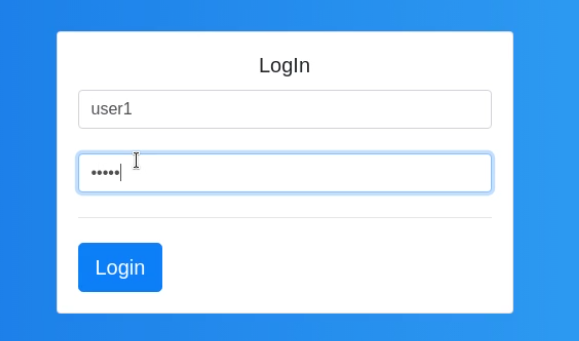
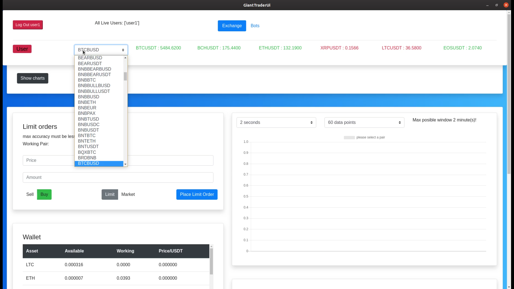
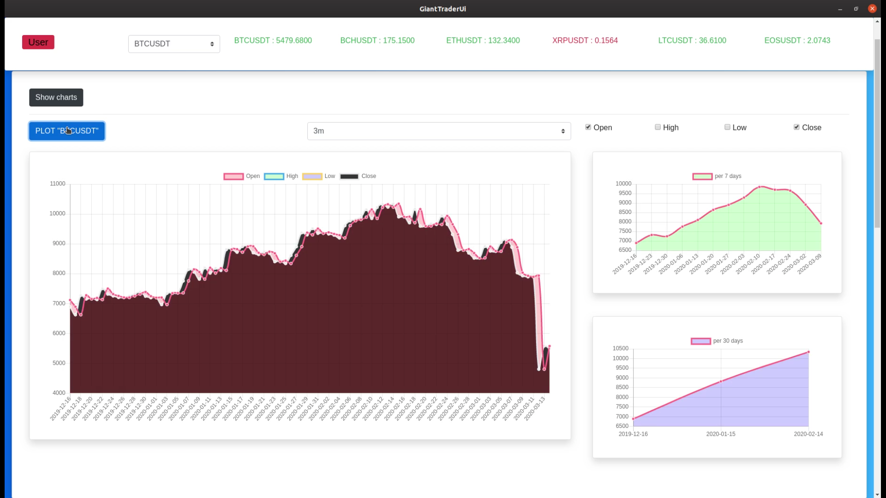
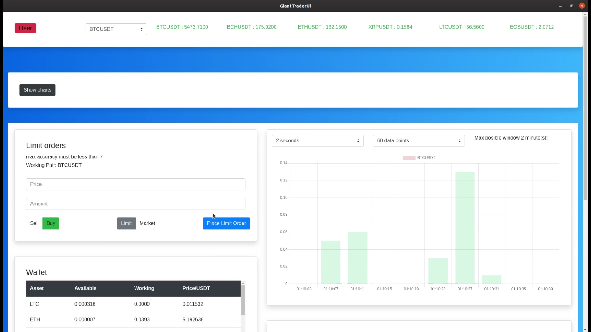
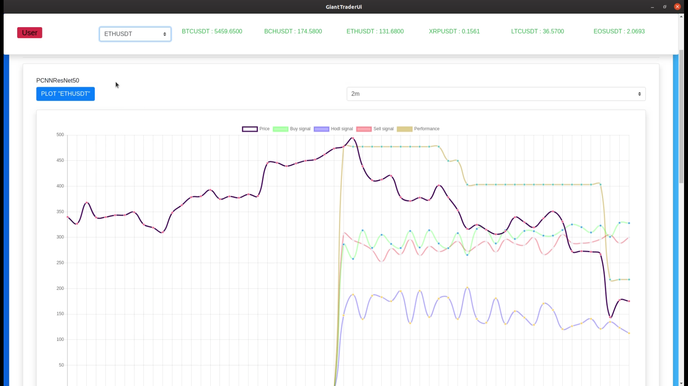
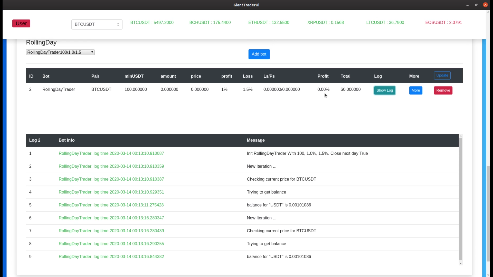

# Giant Trader 
[Demo](https://www.linkedin.com/embed/feed/update/urn:li:ugcPost:6644926669507317760?compact=1)

The software can connect to Binance exchange and perform trades with different neural networks or hardcoded rules. It provides a user interface with charts and feedback text describing the current state of the bots. 

## Backend 
* Flask, Flask-Restful
* TensorFlow 1.5
* Keras
* numpy
* OpenCV 3
* PostgreSQL and SQLite3 (depends on a service)

## Frontend
* AngularJs
* nginx

## Architecture
* Microservices
* Docker (For managing services)


        1.Type "docker-compose build" in folder "docker"
        2.Type "docker-compose up" to start the software 
        3.Wait until you see messages from "docker_ang_<num>" container  
        4.Navigate to localhost:10003
        5.Use "giant" for default login and password (most function will not work with default user)
        6.Register your user (you will need binance api key and secret)

## UI

<h3> Login Page. </h3> 
</img>
<br><br>
<h3> Select asset to trade from top panel, it can only be changed here, so every operation uses selected asset until it is changed. </h3>
</img>
<br><br>
<h3>Basic exchange functionality for quick limit or market orders.</h3>
<h3>Live view of currently open orders and wallet.</h3>
</img>
<br><br>
</img>
<br><br>

</img>
<br>
<h3>Here you can starts bots, which will trade for you. You can have as many bots as you want for every pair. The bots will trade if they have access to $11. For example if you have $100 this will allow 9 bots to run at the same time.</h3>
</img>
<br><br>
<h3>RollingDay means the bot will close its position at the end of the day regardless of the trade status. </h3> 

<h3>As long as the server is running the bots will continue trading even if you close the browser. To stop the bots, press on the remove button and wait "for some bots it can take more than 3 minutes to stop".
To immediately prevent bots from placing orders just log out the user from the top panel or stop the server by typing on terminal: </h3>


        docker-compose down 
<h3>in "docker" folder</h3>

<br>

# For development
You don't need to know how the whole code works, you can focus on the service you are interested in. Just use the right directory for the service.


if you want to work on UI use [giant-trader-ui](giant-trader-ui) dir
* for exchange use [biance](python/binance/app) dir
* for automatic trading [bots](python/Bots) dir
* for machine learning [AI](python/AI) dir

To start the services for development use ``` docker-compose -f docker-compose-dev.yml up ``` when containers are ready you can manually start the services you want, use ``` docker exec -ti <name of the container> bash``` to connect to a container.

To start python services type ```python3 start.py```

for frontend use ```ng serve --host 0.0.0.0``` if you get errors try ```npm i```  

<br>

# Notice

Software is provided as it is, use it at your own risk. 